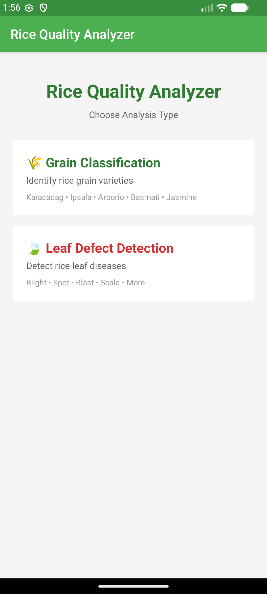
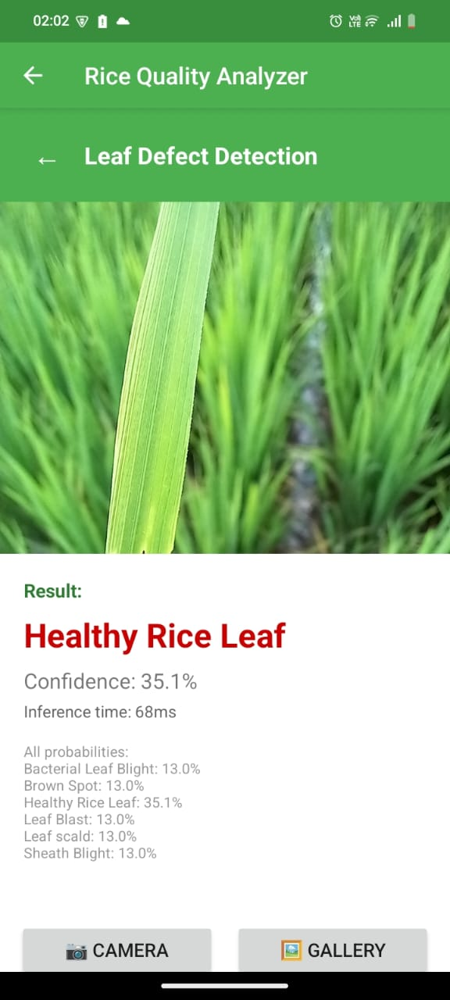
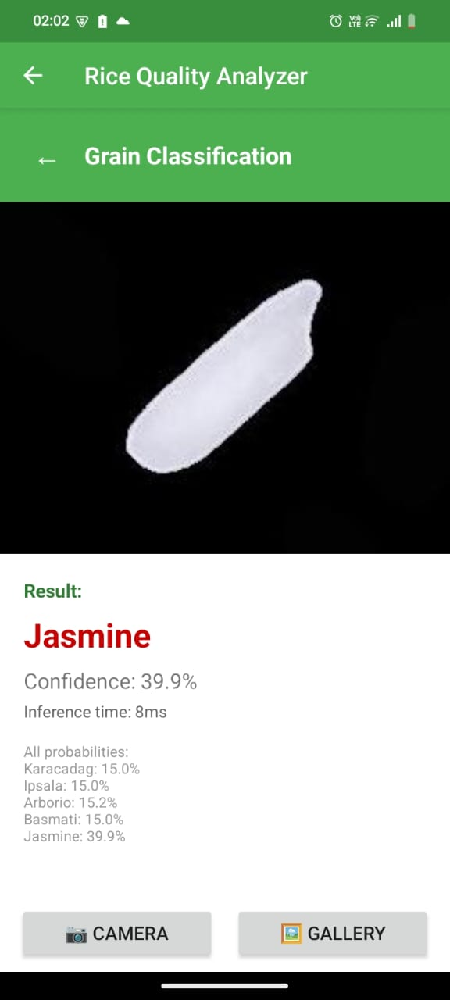

# Rice Grain Quality Detection – Edge AI Prototype

## 1. Problem Statement

Rice grain quality assessment is traditionally performed through manual inspection, which is:
- Time-consuming
- Subjective
- Error-prone at scale

The goal of this project is to build a lightweight computer vision system that can automatically assess rice grain quality and detect defects or impurities, while being efficient enough to run on edge/mobile devices.

The system aims to:
- Identify different types of rice grains and defects
- Detect foreign objects mixed with rice
- Run inference efficiently on low-resource hardware (mobile/edge)

## 2. Datasets

Three datasets were used during experimentation to explore different modeling strategies.

### 2.1 Rice Quality Parameter Dataset 

**Description**  
This dataset consists of rice images in different lighting and background. It contains different rice particles like head rice, broken rice mixed with other impurities

**Classes**
- Head Rice
- Broken Rice
- Immature Rice
- Chalky Rice
- Red Rice
- Unhulled Rice
- Foreign Object

**Qualities**
- Mixed rice particles in different background and lighting
- Good for fine grain quality inspection

**Drawbacks**
- Contains only images
- Dataset is not classified or annotated
- Annotating is time consuming


### 2.2  Rice Defect Dataset

**Description**  
This dataset contains images of rice plants with classes.

**Classes**
- Bacterial Leaf Blight
- Brown Spot
- Healthy Rice Leaf
- Leaf Blast
- Leaf scald
- Sheath Blight

**Qualities**
- Separate classes for defective leaves
- More realistic for real-world quality assessment
- Aligns well with industrial inspection use cases

**Drawbacks**
- Images are of different sizes
- Image size is only 3829 images

### 2.3  Rice Image Dataset

**Description**  
This dataset contains images of different rice grains with classes

**Classes**
- arborio
- basmati
- ipsala
- jasmine
- karacadag

**Qualities**
- Separate classes for different rice grains
- large image size
- images are of same dimensions

**Drawbacks**
- dataset is not suitable for quality assessment
- dataset is not suitable for defect detection

## 3.My Approach

After understanding all three of the available datasets, I decided to use the  Rice Quality Parameter Dataset for training the model. I also experiemented with the other two datasets to understand them better and also as a good warmup exercise. 

My idea was to annotate the  Rice Quality Parameter Dataset using labelImg then train a model like YOLO or SSD to detect objects from the image. Labeling took me a lot of time and in between labelling I tried to train a simple CNN model on the other 2 datasets. The Rice Defect Dataset would be pretty useful for training a model to detect defects in rice leaves and farmers would benefit from this model. All the training was done on kaggle (for classification based approach) and on collab (for detection based approach). GPU T4 was used for training the models.

### 3.1 Detection Based Approach

**Description**  
A lightweight YOLO-based object detection model was trained to detect and localize individual rice grains and foreign objects. I used LableImg to manually annotate the images. 108 images were annotated and used for training the model. Data labelling was the most time consuming part of the task. Data augmentation was done to increase the diversity of the dataset. Model was trained for 200 epochs and the best weights were used for evaluation.

**Workflow**
1. Annotate images with bounding boxes using labelImg
2. Train YOLO Nano for small object detection
3. Export optimized model to tflite for edge inference

### Trade-Off Analysis

| Metric               | Base Model | TFLite Model    | 
|----------------------|------------|-----------------|
| **mAP@0.5**          | 0.9796     | 0.7500          | 
| **Recall**           | 0.95       | 0.0048          | 
| **Model Size**       | 5.6 MB     | 3.15 MB         |     
| **Inference Time**   | 16.061 ms  | 517 ms          | 

**Key Observations:**
The edge optimized model did not perform well during testing. The recall was very low and the inference time was too high. 

### 3.2 Classification-Based Approach

#### 3.2.1 Rice Leaf Defect Classification

**Description**  
A lightweight CNN-based image classification model was trained to predict the overall quality of rice leaves. The dataset contains images of rice leaves with defect classes. The model is designed to be computationally efficient while maintaining strong classification performance. The architecture progressively learns low level texture patterns such as color changes and lesions, and then higher-level disease specific features, which are critical for rice leaf defect identification.

**Workflow**
1. Resize images to a fixed resolution
2. Pixel values are normalized to improve training stability
3. Apply lightweight CNN architecture
4. Train using image level labels with categorical cross-entropy loss.
5. Post training quantization is applied to reduce model size and inference latency.
6. The optimized model is converted to TensorFlow Lite (TFLite) for mobile and edge-device inference.


### Trade-Off Analysis

| Metric               | Base Model | Quantized Model | Improvement         |
|----------------------|------------|-----------------|---------------------|
| **Accuracy**         | 0.9466     | 0.9433          | -0.35%              |
| **Model Size**       | 28.98 MB   | 2.42 MB         | 91.65% reduction    |
| **Inference Time**   | 8.49 ms    | 8.95 ms         | -5.42%              |

**Key Observations:**
- **Minimal Accuracy Drop**: Only 0.35% decrease in accuracy after quantization
- **Significant Size Reduction**: 91.65% smaller model size (12x smaller)
- **Negligible Latency Impact**: Only 0.46ms increase in inference time

The quantized model achieves an excellent balance between model size and performance, making it highly suitable for deployment on resource-constrained devices.

#### 3.2.2 Rice Grain Classification

**Description**  
A lightweight CNN-based image classification model was trained to classify images of rice grains into different classes. The dataset contained images of different types of rice grains. A CNN model was used to classify the images into different classes. The model was later converted to TFLite for mobile and edge-device inference. A quantized model was also created to reduce the model size and inference latency.

**Workflow**
1. Resize images to a fixed resolution
2. Apply lightweight CNN architecture
3. Train using image-level labels
4. Optimize using quantization for mobile deployment

### Trade-Off Analysis

| Model            | Size (MB) | Accuracy | Latency (ms) |
|------------------|-----------|----------|--------------|
| **Base Model**   | 0.16      | 0.970    | 58.81        |
| **TFLite FP32**  | 0.04      | 0.947    | 0.43         |
| **TFLite INT8**  | 0.02      | 0.393    | 1.03         |

**Key Insights:**
- **TFLite FP32** provides identical accuracy to Base Model with **lower latency**
- **TFLite FP32** reduces model size by drastically compared to Base Model
- **TFLite FP32** offers the best balance between accuracy and performance

The TFLite model achieves an excellent balance between model size and performance, making it highly suitable for deployment on resource-constrained devices.

### 4. Inference scripts
There are 2 inference scripts for the models. There are located in the `scripts` folder.

- `predict_rice_grain.py` - for rice grain classification
- `predict_rice_defect.py` - for rice leaf defect detection

#### Usage

```bash
pip install -r requirements.txt

cd scripts

python predict_rice_grain.py  path/to/image.jpg
python predict_rice_defect.py path/to/image.jpg
```

Example:

```
(rice) john@johns-MacBook-Air scripts % python predict_rice_defect.py ../data/Rice_Leaf_AUG/Leaf\ Blast/aug_0_101.jpg

============================================================
RICE LEAF DEFECT CLASSIFICATION RESULTS
============================================================
Image: ../data/Rice_Leaf_AUG/Leaf Blast/aug_0_101.jpg
------------------------------------------------------------
Prediction: Leaf Blast (94.14% confidence)
============================================================
```
### 5. App 

The app is a simple app that allows users to analyze rice grain quality or detect rice leaf defects or foreign objects. The app is built using Android Studio and uses TensorFlow Lite for inference. The app has the option to select the type of analysis the user want to perform. They can choose to do rice grain classification or rice leaf defect detection. (had added detection for foreign objects but it was not working and the accuracy was too low) The app gives the user the ability to use images from their gallery or take picture from the camera.

#### Setup and Installation

1. **Prerequisites**:
   - Android Studio (latest stable version)
   - Android device or emulator with camera support

2. **Clone the repository**:
   ```bash
   git clone https://github.com/johntharian/rice-quality-detector.git
   cd rice-quality-detector

3. **Open the project**:
    1. Launch Android Studio
    2. Select "Open an Existing Project"
    3. Navigate to the app directory and click "Open"

4. **Build the project**:
    1. Wait for Gradle to sync and download dependencies
    2. Connect an Android device or start an emulator
    3. Click "Run" (green play button) or press Shift + F10

5. **Using the app**:
    1. Select the type of analysis you want to perform
    2. Choose to take a photo or select from gallery
    3. View the analysis results with confidence scores






#### Setup

1. Clone the repository
2. Open the app in Android Studio
3. Build and run the app


